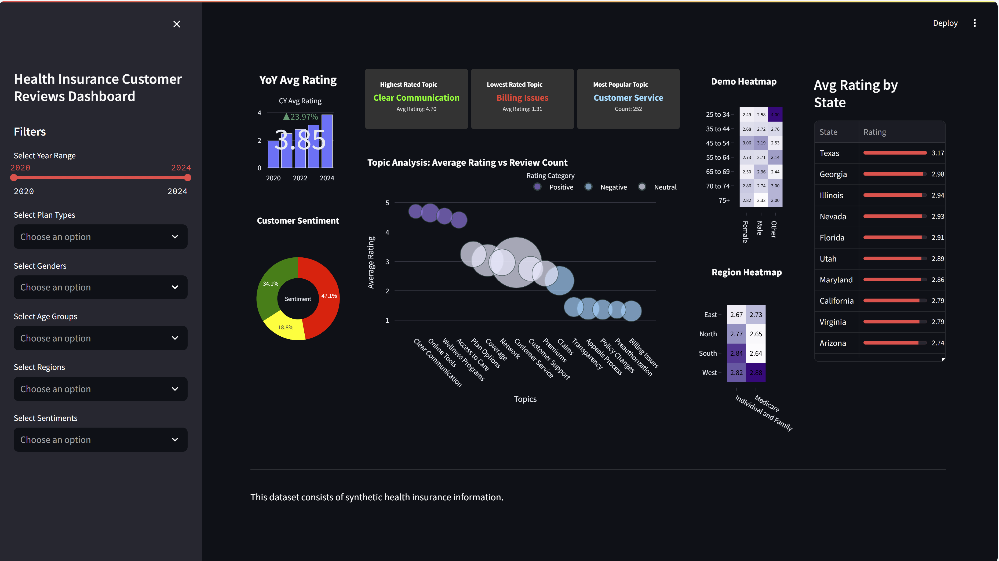

# Analysis of Customer Reviews for Health Insurance Providers

## Project Description
This project involves conducting a comprehensive analysis of synthetic customer reviews for health insurance providers to identify patterns and assess satisfaction levels. The findings will be presented visually through interactive dashboards.

## Objectives
- Analyze synthetic customer reviews to uncover patterns and satisfaction levels.
- Generate and store synthetic data using Python and OpenAI API.
- Clean and preprocess data for analysis.
- Develop interactive dashboards using Tableau, Streamlit, and Google Looker Studio.
- Identify actionable insights to enhance online sentiment.

## Stakeholders
- Health insurance providers
- Data analysts and scientists
- Business decision-makers
- Marketing and customer service teams

## Technologies Used
- **SQL:** For database management and querying.
- **Python & OpenAI API:** For generating and storing synthetic data.
- **Python:** For data cleaning and analysis.
- **Dashboard Creation:** Using tools such as Tableau, Streamlit, and Power BI.

## Development Process

### Synthetic Data Creation
- Utilize Python and OpenAI API to generate synthetic customer reviews.

### Exploratory Data Analysis (EDA)
- Perform initial analysis to understand the data distribution and identify key features.

### Data Cleaning and Preprocessing
- Clean and preprocess the data to ensure accuracy and consistency for analysis.

### Insights and Interpretation
- Analyze the data to uncover patterns, trends, and insights into customer satisfaction.

### Visualization and Reporting
- Create visualizations to effectively communicate findings.

### Dashboard Creation
- **Streamlit Plotly Dashboard:** Develop an interactive dashboard using Streamlit and Plotly to display trends in patient satisfaction.
- **Tableau Community Dashboard:** Create a Tableau dashboard to present the analysis and insights.
- **Google Looker Studio Dashboard:** Build a dashboard in Google Looker Studio for comprehensive reporting.

## Analyze the Pros and Cons of Using Tableau, Google Looker Studio, and Streamlit
### Streamlit Dashboard:

- **Streamlit:**
  - Pros: Highly customizable, suitable for creating interactive web apps, open-source.
  - Cons: Requires programming knowledge, less user-friendly compared to Tableau.

### Tableau Dashboard:
- **Tableau:**
  - Pros: User-friendly, strong data visualization capabilities, robust community support.
  - Cons: Requires a license, limited flexibility in customization.

### Google Looker Studio Dashboard:
- **Google Looker Studio:**
  - Pros: Free to use, easy integration with Google services, good for reporting.
  - Cons: Limited advanced visualization options, slower performance with large datasets.


## Conclusion
This project demonstrates the use of synthetic data to analyze customer reviews and develop interactive dashboards. The analysis and visualization help in identifying actionable insights to improve customer satisfaction and online sentiment. The comparison of Tableau, Google Looker Studio, and Streamlit highlights their strengths and limitations, providing a comprehensive overview of tools for building health insurance data dashboards.

---

### How to Run the Project

1. **Clone the repository:**
   ```sh
   git clone https://github.com/Prvargas/Online_Reviews_Analysis.git
   
   cd Online_Reviews_Analysis
   ```

2. **Install the necessary dependencies:**
   ```sh
   pip install -r requirements.txt
   ```

3. **Run the Streamlit dashboard:**
   ```sh
   streamlit run health-dashboard.py
   ```

4. **Access Tableau and Google Looker Studio dashboards:**
   - Follow the links provided in the repository to view the dashboards.

---

### Directory Structure

```
Online_Reviews_Analysis/
│
├── data/
│   ├── raw/
│   └── processed/
│
├── notebooks/
│   ├── 01_synthetic_data_notebook.ipynb
│   ├── 02_EDA_1_notebook.ipynb
│   └── 03_analysis_notebook.ipynb
│
├── src/
│   ├── __init__.py
│   ├── data_generation.py
│   ├── data_cleaning.py
│   └── analysis.py
│
├── dashboards/
│   ├── streamlit/
│   ├── tableau/
│   └── looker_studio/
│
├── requirements.txt
└── README.md
```
